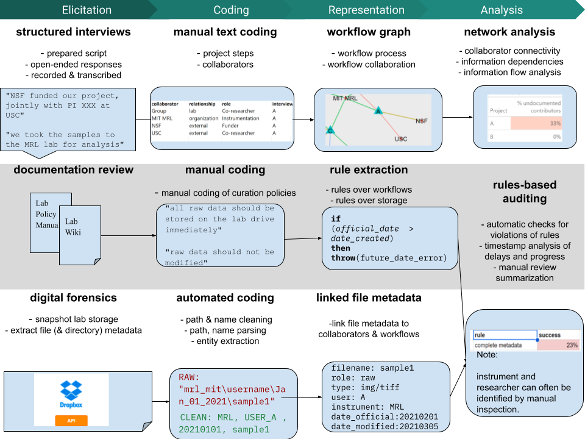

Mechanical

```{r setup, include=FALSE, echo=FALSE}
library(knitr)
## options for this document
doc_debug <- params$doc_debug
doc_refresh_data <- params$doc_refresh_data
#doc_refresh_data <- TRUE
knitr::opts_chunk$set("message" = doc_debug)
knitr::opts_chunk$set("warning" = doc_debug)
knitr::opts_chunk$set("tidy" = FALSE) # already tidyed using stylr
knitr::opts_chunk$set(autodep=TRUE)
knitr::opts_chunk$set(cache = params$doc_cache)


# VOODOO for detecting whether target is pdf in
# Rstudio -- note that knit is producing latex, rstudio then
# uses pdflatex. Hence pandoc.to target is latex

doc_is_pdf <- FALSE
doc_is_pdf <-  try (("pdf_document" %in% rmarkdown::all_output_formats(knitr::current_input())), silent=TRUE)
doc_is_pdf <- (doc_is_pdf == TRUE) &&
  (opts_knit$get("rmarkdown.pandoc.to")=="latex")


# works in knit, but not in other environments
try(knitr::dep_auto())

#libraries
library("tidyverse")
library("readxl")
library("haven")
library("magrittr")
library("DiagrammeR")
library("tidygraph")
library("igraph")
library("ggraph")
library("gt")
library("crosstable")
library("patchwork")
library("lubridate")
library("ggthemes")

# graphic options
knitr::opts_chunk$set(dpi=300)
```

```{r theming, echo=FALSE}
theme_set(theme_grey(base_size = 8))
```

# Introduction {#introduction}

## Background

### Increasing Attention to Reproducibility, Openness, and Attribution in Science

Reproducibility is a foundation of science. Over the last two and half decades, however, mounting evidence has called
into question the reproducibility of findings in a continually expanding set of fields -- leading to regular calls to
assess reproducibility and improve scientific practice systematically [@ReproducibilityReplicabilityScience2019]. And
more recently, there have been high-profile calls and initiatives by research societies, funders, and publishers to make
scientific practice and data more open and transparent [@wilkinson2016,@opensci2018]and to develop systematic
attribution standards and [@mcnutt2018] practices for contributors to scientific publications and outputs.

Science stakeholders increasingly realize that a scientific discipline's reproducibility needs to be empirically
evaluated, not simply assumed. A hallmark study by the National Academies [@ReproducibilityReplicabilityScience2019]
reviewing the state of knowledge on scientific transparency finds that the evidence base of non-replicability across all
science and engineering research is incomplete: Scientific practices of replication are neither sufficiently consistent
nor sufficiently enough to make confident statements about the rate of replicability in most fields. However, the major
empirical studies of replication failure conducted in the natural, clinical, and social sciences have yielded
replication failure rates ranging from somewhat lower than 20% to higher than 80%. Further, the report found an uneven
awareness of issues related to replicability practices and awareness across fields and within fields of science and
engineering.

Similarly, although many fields have widespread norms or even stated policies on research transparency (e.g., making
data available after publication) and appropriate attribution of contributors, these policies are unreliable predictors
of practice. See, for example, [@tenopir2011,@savage2009]. Empirical evaluation is needed to understand how and where
these practices are followed and what effects they yield.

### Studies of Practices in Experimental MSE

Schechtman's Nobel-winning discovery of quasi-crystals stands as a particular occurrence (and eventual resolution) of
the classic "file-drawer" problem [@timmer2011] that is highlighted by open-science advocates --- but this is one
illustration with a happy ending and cannot establish a pattern. Few published studies describe or evaluate practices
related to replication, transparency, and attribution in Materials Science and Engineering (MSE).

A more recent study suggests a rosier picture -- an analysis of retractions in MSE publications finds a relatively low
rate (0.03%) [@coudert2019]. However, while a high retraction rate signals problems, most non-replicable research is
generally not retracted, so a low retraction rate does not strongly suggest replicability. Another recent study
examining data-sharing practices in small MSE labs [@wilson2019a] revealed that while many researchers in materials
science embrace the idea of open science, reproducible research, and data sharing, they are frustrated with the
inadequate infrastructure, tools, and practice guidelines. This finding suggests the potential for gaps between
aspiration (for reproducibility, openness, etc.) and practice. Perhaps most concerning, however, is a recent set of case
studies [@han2019a] published in the *Annual Review of Chemical and Molecular Engineering* that found a high (20%) rate
of reproducibility failure in the two research areas, the properties of metal-organic frameworks (MOFs) and synthesis of
crystalline nanoporous materials, were targeted for study. A 2017 study on isotherm measurements in MOFs also revealed a
similar level of irreproducible rate [@park2017].

Experimental materials science typically does not generate large quantities of data through coordinated or collective
studies compared to geology, genomics, and some disciplines within economics. In MSE, experimentalists generate
materials property data in their 'small labs' individually and have not developed a shared practice of data sharing as
in many other 'big data' disciplines. Moreover, gaps in experimental data availability have been identified as a barrier
to computational materials science since the early 1980s [@westbrook1983] and remain a significant obstacle to progress.

Rapid progress in data science and the ever-increasing number of demonstrated applications of data science approaches in
data-rich fields produce optimism that data science can also be productively applied to materials science
[@technolo2013]. Significant progress in this direction requires significant data resources. Pioneering studies
highlight the difficulty in assembling large quantities of experimental materials science data that can be the basis for
valuable and insightful inferences [@raccuglia2016].

In the past decade, the renewed promise of machine learning and its applications in materials science has made the need
for FAIR experimental data more urgent [@blaiszik2016]. Further, applying machine learning and artificial intelligence
to materials science at scale has been identified as a grand challenge for the discipline dependent on robust tools and
practices for data sharing and replicable workflows [@stein2019]. Last year, the NSF Division of Materials Research
underscored the importance of transparent access to data by issuing specific policy guidance for the field [@dearcol].

Data resources can grow through open-science practices such as sharing data generated across the research lifecycle.
Still, experimental materials science lacks the norms, standards, and tools to make this widespread, especially for
academic labs. There have been notable efforts to develop infrastructure, standards, and tools to enable experimental
reproducible workflow management and data sharing in materials science [@hill2018] [@himanen2019]. For example, the
4Ceed project [@nguyen2017] developed a cloud framework and associated curation services for real-time capturing of
materials data from instruments based on a survey they carried out among experimentalists [@userstu2016]. The Materials
Data Facility (MDF) service launched in 2016 [@blaiszik2016] was designed to provide an interconnection point for data
sharing, discovery, access, and analysis. The MDF (Material Science Data Facility), sponsored by the National Institute
of Standards (NIST) and the Center for Hierarchical Materials Design (CHIMaD), now hosts about 578 datasets (116
experimental datasets) and indexes over 970,000 records of Materials data from other repositories as of December 2021.
Other recent efforts include infrastructure for a federated registry of information resources for materials science
[@plante2021]; a proposed controlled vocabulary and metadata schema for materials discover [@medina-smith2021]; and a
new experimental infrastructure under development for the integration of Electronic Lab Notebooks and data archiving
systems with materials science workflows [@brandt2021]. In industry, software platforms (e.g., Citrine Platform
[@citrineinformatics] ) that combine the data management infrastructure and AI-based tools facilitating materials design
provide customizable solutions for corporate labs, which have more consistent pipeline workflows and can afford the
resource-intensive infrastructure. FAIR-DI (FAIR Data Infrastructure for Physics, Chemistry, Materials Science, and
Astronomy e.V.), a European-originated effort, aims at building a reliable infrastructure for data from materials
science, engineering, and astronomy that follows FAIR principles [@fair-di]. FAIR-DI launched the NOMAD repository
(<https://nomad-lab.eu/>) in 2014 and has been developing data management and sharing support. Their recent FAIRmat
hands-on Tutorial Series [@fair-di] is designed to provide connections between the existing infrastructure and
researchers' daily practices.

More recently, as a paradigm shift rooted in the exponential growth of computing power, integrated systems of Artificial
intelligence (AI) based predictions and experimental automation via robotics are explored and examined to accelerate
materials discovery with the promise of replacing the manual and human-intensive material discovery process
[@pyzer-knapp2022]. For example, a technology roadmap was outlined to articulate the hardware and software
infrastructure requirements and demonstrate a re-imagined role of humans as ensuring data is appropriately managed,
aggregated, standardized, and shared [@delgado-licona2023]. The analysis of the potential to apply accelerated materials
discovery in clean energy highlighted insufficient experimental datasets for AI model training as a limitation for clean
energy as a relatively new technology [@maleki2022].

Notwithstanding these particular efforts and the overall progress in developing tools, standards and practices, the
adoption of these infrastructure and tools by individual "small" labs remains limited. No direct solutions have been
provided for individual labs to streamline their workflows and efficiently prepare their data for sharing throughout the
research lifecycle. Instead, these labs use informal sociotechnical workflows that combine documented procedures,
undocumented conventions, semi-automated tools, and manual processes. In this research, we elicit the informal workflows
operating within a top material science lab, document and describe these using a formal workflow graph notation, and
analyze these workflows using qualitative and mathematical graph analysis.

## Research Questions {#ResearchQuestions}

This study aims to identify potential gaps and challenges for small-lab MSE research replicability (trustworthiness),
data availability (transparency), and attribution through an in-depth analysis of the practices supporting workflow and
data management at a leading lab.

To identify the gaps and opportunities in the current research practice for such improvements, we designed our study to
answer the following research questions probing the trustworthiness and transparency of MSE data curation:

1.  To what extent does research depend on manual processes for information management?

2.  Explicit processes:

    (a) What processes concerning data and research workflow management are documented?\
    (b) To what extent are documented processes consistent with practice?

3.  To what extent are documentation processes complete enough to support another person's replication of a result
    within the lab (without further communication with the original researcher)?

4.  To what extent are data management processes robust enough to survive the departure of a project member or the loss
    of an individual's personal computer or storage?

5.  To what extent are workflow data, outputs, and documentation sufficient to describe responsibility (or support
    attribution) for published results?

# Data and Methods

## Overview

This study focuses on practices within the research group for several reasons. First, internal data management is a
prerequisite for external data sharing and transparency. If research information created by one research becomes
unavailable, uninterpretable, or irreproducible for a close team member, there is little hope it can be made
meaningfully available for external reuse and review. Second, MSE relies in large part on internal processes to
guarantee replicability -- there are no formal processes for external validation, systematic studies of replicability
conducted across the field, nor systematic reporting guidelines for reporting failures. Further, null results and those
deemed uninteresting may end up in the file drawer and thus not made available for any external examination. Moreover,
even published results of sufficient commercial value for an enterprise to attempt them in production may fail and be
discarded without any subsequent reporting. Third, similarly, MSE relies almost entirely on internal processes to ensure
appropriate attribution of work.

Our approach employs a purposive case-study design. We select a leading MSE research lab and interview selected lab
members in detail about their most important research project. As illustrated in Figure 1, we code the collected
interview data to create a standardized description of each task conducted for the project step and use this to
construct a formal workflow process graph. By tracing across and within these graphs, we characterize overall
collaboration and information flow patterns -- and evaluate the extent to which information shared with the group is
sufficient for replication and attribution.



We supplement these workflow graphs with information gained through a review of lab documentation and an audit of the
lab's digital repository. Through manual coding of the documentation, we can extract rules \-- which can be tested using
extracted file-level metadata (digital forensics) collected through the audit.

## Case and Interviewee Selection

The use of 'small lab' is common in the literature but often used unaccompanied by a precise definition. Within this
paper, we use the term 'small lab' to refer to a set of researchers that (a) self-identified as a research collective,
(b) aims to conduct research and produce scholarly communications, (c) is substantially responsible for identifying its
research agenda, design, and methods (d) contains under twenty people, and (e) conducts experiments.

Although it is not possible to precisely determine the number of 'small labs' in science generally because no
comprehensive survey of research groups exists. However, past research into research group size in selected disciplines
and countries (e.g. [@cook2015; @brandt2021; @qurashi1984; @seglen2000] ) suggest that 'small' research groups are a
common or the predominant form of organization within the natural and applied sciences.

Concerning MSE, the total number of research groups is unknown. However, public rankings of universities establish that
at least seven hundred and fifty academic materials science programs worldwide exist -- and a substantial proportion of
these likely include small MSE labs.

Professor Rafael Jaramillo's group conducts experimental materials science within the Department of Materials Science
and Engineering at the Massachusetts Institute of Technology. Their research focuses on the synthesis, properties, and
application of electronic materials. Each research project in the group generates many experimental datasets and can be
supplemented by computational studies for revealing mechanisms or analyzing structures. This typical type of workflow
bonds the four elements of MSE research: structure/composition, synthesis/processing, properties, and performance
[@flemings1999].

The Jaramillo lab meets all of the criteria of a small MSE lab -- it has a scientific aim, collects its own data from
local experiments, comprises less than 20 FTEs, provides its own scientific direction, and oversees its own methods and
infrastructure. However, the lab is unlikely to be statistically representative of small materials science labs for
several reasons.

External rankings of MIT's materials science department place it in the top five schools worldwide. MIT is a
well-resourced institution, and MIT faculty are typically well-supported. MIT faculty, and Professor Jaramillo
specifically, are generally successful in obtaining external research support. Professor Jaramillo is interested in
reproducible research and open science: he has published in this area, group has developed related software prototypes
and grant proposals, and advocated for reproducible and open science practice within his institution and discipline.
Thus, this lab should be considered a near-best-case for FAIR data workflows in small materials science labs -- it is
implausible that many other small experimental materials science groups have the resources, experience, or interest to
do substantially better in this area.

Synergistic collaboration between group members, including graduate students and postdoctoral fellows, allows for
continuous monitoring lab equipment. This collaboration is facilitated by shared information repositories, including a
group Electronic Lab Notebook (ELN) in LabArchives, a group Dropbox account, and Google Drive. Access to all the
cloud-based storage and services are provided to the group via MIT campus-wide site licenses. Protocol for saving and
sharing information is specified in a group manual, which all researchers in the group are encouraged to follow for both
the group repositories and their personal data storage systems. In this way, this lab is representative of good
practices for data-sharing, as individual data from one researcher is, ideally, stored in a format that is
comprehensible to and a location that is accessible by all members of the lab. Consequently, reproducibility of research
is possible in the absence of the originator of the research.

Investigating the workflow of four researchers within the Jaramillo group highlights which practices are most essential
to open and reproducible research - these practices appear to be standardized across the researchers in the lab despite
idiosyncrasies due to personal preference. Identifying these practices allows other "small academic labs" to formulate
and adopt the most effective structure for their data storage framework.

## Data Collection Methods

We conducted structured interviews with four graduate students in Jaramillo's group to obtain the specifications of
their workflow, data profile, and challenges in daily practices. This study (Exempt ID: E-2317) has been determined to
be exempt from further review by the Committee on the Use of Humans as Experimental Subjects (COUHES) at MIT on June 2,
2020.

Two researchers interviewed each graduate student: one served as the interviewer and the other as the transcriptionist.
The interview audio was recorded and reviewed compared to the transcribed notes post-interview for completeness and
accuracy.

The interview protocol (see Appendix I) consisted of three sections: Interviewee Background, Top Priority Project
Background, and Top Priority Project Workflow. The protocol was a guideline for the interviewer to construct the most
complete narrative of each student's workflow. Each question was explicitly asked or indirectly answered through the
student's response to a different question.

For the last section, Top Priority Project Workflow, it became evident that the most natural interview process was one
in which the student first described the overall workflow for the selected project and then was prompted to recall each
operational step. The interview would then ask follow-up questions to fill gaps and probe for additional detail.

## Interview Coding

The interview coding process aimed to describe each step of the workflow in a systematic structure database. There is a
wide range of existing formal models for provenance and workflow (see, for example, [@jandre2020]). However, most of
these are designed for automated execution, and contain much more detail than is feasible to elicit during a standard
interview. We thus used a simplified coding approach in which the actions each described action were labeled with their
objective, task, and subtask, and the sequence, actor, input, output, data source, data target, level of automation,
type of action, equipment, and methods used were recorded using standardized codes. (See appendix.) This tabular data
was then used to impute collaboration and data-dependency graphs (see the *Results* section below).

The coding of the research workflow was conducted in four phases.

The first phase involved the direct translation of each interviewee's narration. During this phase, only the steps in
the sequence that were explicitly stated were recorded.

The second phase was an interpretation: the intended meaning of each statement was derived by assessing what the
researcher implied but did not explicitly state. Each step of the workflow sequence has a series of subsequences that
occur before and after the main objective. For example, when a physical material is placed in storage, it is implied
that the next step involving it requires its removal from storage. The first and second phases were completed for all
interviewees before progressing.

The third phase was inference. The same synthesis, characterization, and analysis techniques were often used across
interviewees, and each lab member was subject to the same regulations to achieve each objective. Therefore, knowledge of
one interviewee's workflow can be derived from what is known from another's workflow. This was used mainly for details
such as the names of analysis software and data output formats.

The fourth phase was extrapolation. The primary coder of this data is a materials scientist who conducted research in
the same facilities as those used by the interviewees. This familiarity allows for inferring implied steps from the
workflow narrative that may not have been uncovered during the interview.

No additional assumptions were made during the coding process. Any gaps in information that could not be acquired
through these four steps were left blank.

## Workflow Representation

We represent workflows as formal graphs and then apply social network analysis methods. (This follows a common approach
to interpretation of workflows, first documented by [@tan2010].) The graph systematically describes all process,
informational, and collaboration dependencies elicited through the interview process. By analyzing these graphs, we can
visually and analytically identify workflow gaps, evaluate processes concerning stated policy, and probe potential
interventions.

We augment this core workflow graph in several ways. First, we create a collaborator network graph by coding the
interviews directly for any mentions of collaborations. Second, we derive separate dependency, collaboration, and
information flow graphs directly from the workflow process graph. Finally, we apply graph methods from network and
social network analysis [@sharir1981; @horwitz1992; @carrington2005models] to probe questions related to collaboration
(through analysis of connectivity and centrality), attribution (through comparing the explicitly elicited collaboration
graph with its workflow-induced counterpart) and replicability (dependency, and subcomponent analysis of the information
flow graph).

The process of creating the graph is summarized below. (For replication purposes, we have placed all of the
de-identified and coded interview data in a public archive, the software code necessary to construct the graph in
detail, and all of the code needed to reproduce all figures and tables.)

-   A node on the graph represents each atomic action ("step") in the workflow. The node documents all of the
    characteristics of that single action.

-   Process dependencies are represented through sequences and sub-sequences linked by "process" edges:

    -   Actions performed by the same person, in a required sequence, for a single goal, and over a continuous period
        are represented by "sequence" nodes. Edges link each sequence to one or more child sub-sequences.

    -   Actions performed within a sequence (and thus by the same person) and practically simultaneous (they have no
        natural order and occur during a brief period) are represented by sub-sequences. Edges link sub-sequences to one
        or more child steps.

-   Informational dependencies are represented by augmenting the graph with "informational" edges. An edge is created
    whenever one of the following conditions holds.

    -   When nodes share common data inputs -- this represents passive information sharing.

    -   When the output of one node is the input for another -- this represents active information sharing.

    -   When a single person conducts nodes during a continuous time (i.e., they are part of the same sequence) -- this
        represents implicit information sharing.

-   Collaboration (attribution) dependencies are represented by augmenting the graph with typed nodes and edges.

    -   Collaborator nodes represent individual or organizational collaborators.

    -   Edges are created from workflows to collaborators when either the collaborator is explicitly referenced in the
        action (e.g., sending results to a collaborator, receiving samples from a collaborator) or by implication --
        when the action involves some instrument (or other tool) provided by a collaborator.

## Digital Forensics

```{r file-forensics-analysis,  echo=!doc_is_pdf}
recent_files.tbl <- read_tsv("Data-deidentified/recent_files.tsv", guess_max=Inf)
recent_files.tbl %<>% rowwise() %>% mutate(
  img_deposit_lag = (client_modified - media_info.metadata.time_taken),
  path_deposit_lag = as.numeric(as_date(client_modified) - path_date)
)  
recent_files.tbl %<>% rowwise() %>% mutate(client_date=as_date(client_modified),
                             cp_date_match = (client_date-path_date)) %>% 
                            ungroup()

sum_lag.tbl <-
  recent_files.tbl %>% 
  select(img_deposit_lag) %>% 
  mutate(img_deposit_lag =img_deposit_lag / 3600) %>%
  pull() %>% 
  as.numeric %>% skimr::skim()  

sump_lag.tbl <- recent_files.tbl %>% 
  pull(path_deposit_lag) %>% 
  as.numeric %>% 
  skimr::skim()   

complete_meta.tbl <-
  recent_files.tbl %>%
  ungroup() %>% 
  summarize(all = mean(path_has_all_meta), any = mean(path_has_any_meta)) 

REP_n_recent_files <-
  dim(recent_files.tbl)[1] 
REP_p_any_meta <-
  (100 * complete_meta.tbl$any[[1]]) %>% round(digits = 0) 
REP_p_all_meta <-
  (100 * complete_meta.tbl$all[[1]]) %>% round(digits = 0)
REP_p_nlag <-
  REP_n_recent_files - sum_lag.tbl[[1, "n_missing"]] 
REP_v_lag75hours <-
  sum_lag.tbl[[1, "numeric.p75"]] %>% round(digits = 0) 
REP_v_lagMax <-
  sum_lag.tbl[[1, "numeric.p100"]] %>% round(digits = 0)
REP_v_plag75days  <-
  sump_lag.tbl[[1, "numeric.p75"]] %>% round(digits = 0) 
REP_v_plag50days <-
  sump_lag.tbl[[1, "numeric.p50"]] %>% round(digits = 0) 

time_consistency.df <- recent_files.tbl %>% count(consistency=sign(cp_date_match)) %>% drop_na() %>% mutate(p=n/sum(n))

TD_postdate <- time_consistency.df[[1,"n"]]
TD_accurate_p <- round(time_consistency.df[[2,"p"]] * 100,digits=1)
```

```{r forensics-timeseries}

library(tsibble)
library(lubridate)

dates.tsbl <-
  recent_files.tbl %>%
  transmute(date = as_date(client_modified)) %>%
  count(date) %>%
  filter(!is.na(date)) %>%
  as_tsibble(key = NULL, index = date) %>%
  fill_gaps()

library(feasts)
tmodel <-
  dates.tsbl %>%
  filter(year(date) > 2015) %>%
  index_by(period = ~ yearweek(.)) %>%
  summarise(count = sum(n, na.rm = TRUE)) %>%
  model(STL(count ~ season("1 year")))

fa1.plot <-
 components(tmodel)%>% 
  autoplot() 
```

Through the interview process, we determined that the lab used a shared folder in Dropbox as its official repository for
collected data and documentation. With permission from the PI, we cloned a snapshot of the repository contents, an
collected all of the file-system metadata for use in a digital forensic analysis. For consistency with lab policies and
with the timeline of the projects we evaluated, we restricted our analysis to files deposited between January of 2019
and January of 2022.

Overall, deposit patterns demonstrated that the repository was actively used -- with deposit rates varying seasonally.
(See Appendix). All information was collected for `r nrow(recent_files.tbl)` files -- including file names, paths,
content hashes, client-side-modification time, and deposit time. For image files, which are a common set of raw data
formats used in this lab, we obtained additional internal timestamps and content metadata. Finally, many files used a
naming convention to embed additional information such as creation date, creating user, and creating instrument -- we
used regular expression-based cleaning and parsing to extract this information where possible. This information set was
then used to check for inconsistencies with documented information organization practices -- as described below in the
results section.

## Post Analysis Validation

After the interviews were completed and their data was coded and analyzed, we validated the results with follow-up
interviews and a documentation review. In the follow-up interviews, we reviewed with each subject the gaps presented by
the preliminary analysis, confirmed whether either the subject believed the gap to exist, and addressed the gap in the
workflow -- through some action not noted in the original interview, the gap was addressed in some other manner. Where
these discussions pointed to workflow steps that had been omitted during the initial interview, we updated the workflow
graphs to include these additions.

We also reviewed the content of the existing group storage systems (specifically, names, directories, and file types) to
characterize data storage patterns per project and compare these to the patterns implied by the workflow analysis. In
addition, we use content analysis to compare information organization naming practice with the documented lab policies.

# Results

```{r deid-load, echo=FALSE, include=FALSE}

collaborator.tbl <- read_tsv("Data-deidentified/collaborator.tsv", guess_max=Inf)
workflows.tbl <- read_tsv("Data-deidentified/workflows.tsv", guess_max=Inf)
meta_storage.tbl <- read_tsv("Data-deidentified/meta_storage.tsv", guess_max=Inf)
meta_instrument.tbl <- read_tsv("Data-deidentified/meta_instrument.tsv", guess_max=Inf)
```

```{r workflow-graph, include=FALSE, echo=FALSE}
###
### Construct workflow networks
###

workflows.tg <- create_empty(0,directed=TRUE)

# add workflow table as nodes

workflows.tg %<>% bind_nodes(
  workflows.tbl
)
workflows.tg %<>%
  activate(nodes) %>%
  ungroup() %>%   mutate(node_type="step") %>%
  group_by(interview,Sequence,`Step SubSequence`) %>% mutate(tmp_row=row_number()) %>%
  activate(nodes)  %>% mutate(node_id=paste(node_type,interview,Sequence,`Step SubSequence`,tmp_row, sep="-")) %>%
  select(-tmp_row) %>% 
  ungroup()
  

# create nodes for SubSequences
workflows.tg %<>% bind_nodes (
  workflows.tbl %>%
    group_by(interview,Sequence,`Step SubSequence`) %>%
    slice_head(n=1) %>% select('Objective','Objective Type',interview,Sequence,`Step SubSequence`,projectid) %>%
    mutate(node_type="subsequence", node_id=paste(node_type,interview,Sequence,`Step SubSequence`,sep="-")) %>%
    ungroup()
)

# add  root node proxy for lab

workflows.tg %<>% bind_nodes(tibble(Objective = "Jaramillo Lab", node_id="root", node_type = "root"))
tmp <- workflows.tg %>% activate(nodes) %>%
  as_tibble () %>%
  filter(node_type=="subsequence") %>%
  group_by(interview)  %>%
  arrange(Sequence,`Step SubSequence`,.by_group=TRUE) %>%
  slice_head(n=1) %>%
  ungroup() %>% rename(to=node_id) %>%
  mutate(from="root",edge_type="owner",weight=1) %>%
  select(to,from,edge_type,weight)


workflows.tg %<>% bind_edges(tmp,node_key="node_id")

rm(tmp)

# add edges to connect sequences

tmp <- workflows.tg %>% activate(nodes) %>%
  as_tibble () %>%
  filter(node_type=="subsequence") %>%
  group_by(interview)  %>%
  arrange(Sequence,`Step SubSequence`,.by_group=TRUE) %>%
  mutate(from=lag(node_id),edge_type="sequential",weight=1) %>%
  filter(!is.na(from)) %>%
  ungroup() %>% rename(to=node_id) %>%
  select(to,from,edge_type,weight)

workflows.tg %<>% bind_edges(tmp,node_key="node_id")

rm(tmp)

# add edges to connect child sub-tasks to sequence steps

tmp <- workflows.tg %>% activate(nodes) %>%
  as_tibble () %>%
  filter(node_type=="step") %>%
  mutate(from=paste("subsequence",interview,Sequence,`Step SubSequence`, sep="-"),edge_type="parent", weight=1 ) %>%
  filter(!is.na(from)) %>%
  ungroup() %>% rename(to=node_id) %>%
  select(to,from,edge_type, weight)

  # Avoid backlinks to induce DAG
  #tmp %<>% bind_rows(tmp,tmp %>% mutate(tmp=to,to=from,from=tmp,edge_type="child") %>% select(-tmp))

workflows.tg %<>% bind_edges(tmp,node_key="node_id")

rm(tmp)

# add edges to connect I/O information-flow  across parent nodes

tmp <- workflows.tg %>% activate(nodes) %>%
  as_tibble () %>%
  filter(node_type=="step") %>%
  filter(`Data Object Input`!=`Data Object Output`) %>%
  select(node_id,`Data Object Input`,`Data Object Output`)

tmp %<>% left_join(tmp,by=c("Data Object Output"="Data Object Input"))%>%
  rename(from=node_id.x, to=node_id.y) %>%
  mutate(edge_type = "information:input_output", edge_value = `Data Object Output` , weight=.1) %>%
  select(from,to,edge_type,edge_value, weight) %>%
  filter(!is.na(to))

workflows.tg %<>% bind_edges(tmp,node_key="node_id")

##linked subtasks imply the parent task is linked
tmp %<>%   rowwise() %>% mutate(to=str_replace(to,"step(.*)-[0-9]$","subsequence\\1"),from=str_replace(from,"step(.*)-[0-9]$","subsequence\\1"))
workflows.tg %<>% bind_edges(tmp,node_key="node_id")


# add edges to connect shared input information-flow across parent nodes

tmp <- workflows.tg %>% activate(nodes) %>%
  as_tibble () %>%
  filter(node_type=="step") %>%
  select(node_id,`Data Object Input`)

tmp %<>% left_join(tmp,by=c("Data Object Input")) %>%
  rename(from=node_id.x, to=node_id.y) %>%
  filter(from!=to) %>%
  mutate(edge_type = "information:shared_input", edge_value = `Data Object Input` , weight=.1) %>%
  select(from,to,edge_type,edge_value, weight) %>%
  filter(!is.na(to))

workflows.tg %<>% bind_edges(tmp,node_key="node_id")

##linked subtasks imply the parent task is linked
tmp %<>%   rowwise() %>% mutate(to=str_replace(to,"step(.*)-[0-9]$","subsequence\\1"),from=str_replace(from,"step(.*)-[0-9]$","subsequence\\1"))
workflows.tg %<>% bind_edges(tmp,node_key="node_id")

# add edges to connect implied information-flow within sequence

tmp <- workflows.tg %>% activate(nodes) %>%
  as_tibble () %>%
  filter(node_type=="step") %>%
  select(node_id,Sequence,interview,`Step SubSequence`)

tmp %<>% full_join(tmp,by=c("Sequence","interview")) %>%
  rename(from=node_id.x, to=node_id.y) %>%
  rowwise() %>%
  filter(from!=to) %>%
  filter(`Step SubSequence.x`<`Step SubSequence.y`) %>%
mutate(edge_type = "information:shared_context", edge_value = paste(interview,Sequence,sep="-") , weight=.1) %>%
  select(from,to,edge_type,edge_value, weight) %>%
  filter(!is.na(to))

workflows.tg %<>% bind_edges(tmp,node_key="node_id")

##linked subtasks imply the parent task is linked
tmp %<>%   rowwise() %>% mutate(to=str_replace(to,"step(.*)-[0-9]$","subsequence\\1"),from=str_replace(from,"step(.*)-[0-9]$","subsequence\\1"))


workflows.tg %<>% bind_edges(tmp,node_key="node_id")

rm(tmp)
```

```{r collaborator-network, include=FALSE, echo=FALSE}
collaborator.tg <- create_empty(0,directed=TRUE)
collaborator.tg %<>% bind_nodes ( tibble(
  name=collaborator.tbl %>% pull(interview) %>% unique(),
  node_type="project", type="project"))
collaborator.tg %<>% bind_nodes ( collaborator.tbl %>% select(Collaborator,`Collaborator organizational relationship`) %>% rename(name=Collaborator, type="Collaborator organizational relationship") %>% group_by(name) %>% slice_head(n=1) %>% ungroup() %>% mutate(node_type="collaborator"))
collaborator.tg %<>% bind_edges( collaborator.tbl %>%
        rename(from=interview, to=Collaborator, edge_type=`Collaborator Role`),
        node_key="name")
```

## Workflow Overviews

```{r wkflow-graph-func, echo=!doc_is_pdf, include=FALSE}
workflow_graph_by_interviewee <- function(interviewee,fignum,savefig=TRUE) {
  
  out.plot <- workflows.tg %>%
  activate(edges) %>% filter(!str_detect(edge_type,"information")) %>%
  activate(nodes) %>% 
      filter(interview==interviewee) %>%
      mutate(`Step Type`=fct_recode(replace_na(`Step Type`,"none"),
          "(dependency)"="none",
          "analysis"="Analyze",
          "data collection"="Simulate",
          "data collection"="Transform",
          "data management"="Store", 
          "data management"="Transfer",
          "data management"="Document", 
          "data management"="Communicate", 
          "data collection"="Measure",
          "materials synthesis"="Synthesize"
          )) %>% 
  #mutate(node_label=ifelse(`Step SubSequence`==1 & node_type=="subsequence",str_squish(str_extract(Objective,"(\\w*)\\s")),"")) %>%
    mutate(main_label=ifelse(`Step SubSequence`==1 & node_type=="subsequence",str_squish(Objective),"")) %>%
     mutate(node_label=ifelse(node_type=="step",str_trunc(str_squish(Method),10),"")) %>%
  ggraph("tree") +
    #geom_edge_link(aes(color=edge_type)) +
    geom_node_text(aes(label=node_label), repel=TRUE, size=2) +
    geom_node_label(aes(label=main_label), repel=TRUE) +
    geom_edge_link() +
    geom_node_point(aes(color=`Step Type`)) +
  labs(title="",color="") +
  plot_annotation(
  title = paste0("Figure ",fignum,interviewee,": workflow overview -- project ",interviewee),
  subtitle = str_wrap("Workflow steps by phases, description, and type. ",100),
  theme = theme_economist()
  ) +theme(legend.position = c(0.15, .3))
  if (savefig) {
      out.plot %>% ggsave(filename=paste0("figs/fig",fignum,interviewee,".png"),width=7,dpi=300)
  }
  out.plot
}
```

For context, we describe the workflows for each of the four projects below:

Interviewee 'A' is involved in generating each output through the workflow sequence: sample preparation, synthesis,
characterization, and analysis. The workflow sequence is iterative. Therefore, the analysis phase results inform how the
next iteration's synthesis process will be tuned. They use a personal LabArchives notebook to record observations.
Metadata from equipment is recorded in the group Dropbox. Pre- and post-processed data are saved to the group Dropbox.

```{r workflow-a,  echo=!doc_is_pdf, fig.width=7,fig.height=7}


workflow_graph_by_interviewee("A",2)
```

Interviewee 'B' received the synthesized sample from a collaborator. They are responsible for preparing the sample for
analysis, characterizing it, and analyzing the data. They use a personal LabArchives notebook as an electronic lab
notebook, so any conditions needed to interpret and replicate a process are recorded. The group LabArchives notebook is
used for recording measurements on lab tools that are shared as to maintain a consistent tool log (required by the
Professor). The group Dropbox is used for saving raw data directly from instruments. Post-processed data is saved to a
personal Dropbox.

```{r workflow-b,  echo=!doc_is_pdf, fig.width=7,fig.height=7}

workflow_graph_by_interviewee("B",2)
```

Interviewee 'C' received the synthesized materials from a collaborator. They prepare the acquired sample for analysis,
characterize it, and analyze the results. Finally, they transforms the sample via a laser set-up; this process is
iterative, as the transformed sample is characterized. A personal OneNote notebook is used for experimental notes.
OneNote is manually synchronized to the group LabArchives notebook. In the group Dropbox, they record all sample notes,
raw data, and analyzed data.

```{r workflow-c,  echo=!doc_is_pdf, fig.width=7,fig.height=7}


workflow_graph_by_interviewee("C",2)
```

Interviewee 'D' is directly involved in each sequence step, which includes sample preparation, characterization,
analysis, and simulation. A personal LabArchives notebook is used to write details of each experiment and record
measurements from equipment from the synthesis process. The group Dropbox is used to save equipment metadata and only
raw or lightly processed data from characterization. A personal Dropbox is used for processed data.

```{r workflow-d,  echo=!doc_is_pdf, fig.width=7,fig.height=7}


workflow_graph_by_interviewee("D",2)
```

Note that each workflow is hierarchical -- each project does not interact (there are no connecting branches), and the
work can be represented as a set of independent, self-contained tasks. (Summary graph statistics are shown in the
Appendix, Table A1.) Most of the tasks contain only one atomic action. Further, there is a rhythm across each workflow
in which the type of task at each step alternates.

All four interviewees used some instruments or equipment outside their lab, either at a shared facility or in a
collaborator's lab. Each interviewee saved a copy of raw data from those instruments in the group Dropbox but had
different practices with transferring data. Each in-house instrument in the lab is overseen by an unofficially
designated group member for its maintenance. Regular maintenance notes for each in-house instrument are recorded in the
shared LabArchives notebook folder.

Group members regularly use equipment outside of the lab and outside of MIT, which interviewees indicate creates
additional data transfer and documentation challenges. Interviewees noted that equipment within the MSE Department is
locatable through an internal wiki -- but there is no other central documentation or standardization around equipment
configuration, data transfer, network access, or acknowledgment of equipment use.

## Workflow Automation

While there is very little systematic research on the rate and frequency of human errors in scientific research
generally (or MSE specifically), a long history of research in the fields of human performance and reliability
engineering suggests that the human error rates are substantial in the absence of well-engineered monitoring and
error-mitigation regimes [@reason1995, @jacobs1995]. For example, over the last fifteen years, human error in medicine
has been a focus of study -- and systematic reviews demonstrate both the high level of harmful and avoidable human error
and the efficacy of error-reduction processes such as the adoption of automated recording systems, and the use of
explicit checklists and logs for manual procedures[@toerri2000, @mederror2021].

During the interviews, we collected information about the types of automation associated with each instrument, storage
facility, and analysis method. As described in the methodology section, each workflow step was coded for the type of
action performed and level of automation used: as 'automated' if the step is initiated automatically following the prior
step; 'partially' automated if the operation was launched manually, but was entirely described by digital metadata
(e.g., configuration files), or as 'manual' if the step depended on manual initiation and manually configuration for
correct operation.

Figure 3 summarizes selected characteristics of the workflow process. This figure reveals that, overall, workflow is
dominated by manual activities.

```{r  descriptives, echo=!doc_is_pdf, fig.height=7,fig.width=7}
workflows.tbl %>% ggplot(aes(fct_rev(fct_infreq(`Step Type`)),fill=`Step Automation`)) +
  geom_bar() + coord_flip() + labs(y="",x="",caption="Action types are mostly storage or analyze.") + theme(legend.position="none")-> p1a
workflows.tbl %>% ggplot(aes(fct_rev(fct_infreq(`Step Automation`)),fill=`Step Automation`)) + geom_bar() +
   labs(y="",x="",caption="Actions are predominantly manual.") + coord_flip() +theme(legend.title = element_blank())  -> p1b
workflows.tbl %>%
  left_join(by=c("Method To"="Storage ID"),
            meta_storage.tbl %>%
              select(`Storage ID`,`Type`) %>%
              rename(`Storage Type`=Type)) %>%
              mutate(`Storage Type`=replace_na(`Storage Type`,"Unknown")) %>%
  ggplot(aes(fct_rev(fct_infreq(`Storage Type`)),fill=`Step Automation`)) + geom_bar() +labs(y="",x="",caption="Actions data is typically stored in cloud, facily, or ELN .") + theme(legend.position="none") +coord_flip() -> p1c

p1b/(p1a| p1c) +  plot_annotation(
  title = 'Figure 3: Selected characteristics of the workflow steps',
  subtitle = 'Summarizes type of action described in each step, proximate data source, and level of automation.',
  caption = paste("(N =",nrow(workflows.tbl)," workflow steps)",sep=""),
  tag_levels = 'a',
    tag_prefix = "(",
    tag_suffix = ")",
  theme = theme_economist()
) -> p3full

p3full %>% ggsave(filename = "figs/fig3.png" , width=7, dpi=300)
p3full
```

This figure provides an answer to the first [research question](#ResearchQuestions), concerning automation:

> 1.  To what extent does research depend on manual processes for information management?

Automation is not a panacea and can increase system complexity or decrease local transparency in ways that increase
errors across a broader system. Notwithstanding, automation is often recommended for tasks that do not involve complex
judgment (e.g., file transfers) and are not otherwise associated with specific performance, audit, and quality assurance
procedures. Further, targeted automation enables people to shift their efforts to tasks where judgment is required and
reduces the cost and effort of logging and auditing. So where errors do occur, they are more readily detected.

Further, explicit communication and documentation are relatively infrequent; there is a high level of reliance on manual
transmission of information (e.g., for instrument setup or for contextualization of the analysis); and a substantial
incidence of e-mail and portable media for information storage. Together, this suggest that there is significant
opportunity for human error in data management and organization.

## Collaboration and Information Flow

In the section above, we used the workflows to show the dependencies between steps in the research process. We use the
same workflow graphs to derive the dependency graph for each analysis and in conjunction with interview data to derive
the collaboration networks.

```{r graph-statistics, echo=!doc_is_pdf, include=FALSE}
graph_table <- function(data,ntypes,etypes,glabel) {
  sequence_control.tg <- data %>%
    activate(nodes) %>%
    filter(node_type %in% ntypes) %>%
    activate(edges) %>%
    filter(edge_type %in% etypes)

  control_dist <- sequence_control.tg %>%
    activate(nodes) %>%
    mutate(x=graph_mean_dist()) %>%
    as_tibble() %>% select(x) %>% pull() %>% unique()

  control_diameter <- sequence_control.tg %>%
    activate(nodes) %>%
    mutate(x=graph_diameter()) %>%
    as_tibble() %>% select(x) %>% pull() %>% unique()

  control_size <- sequence_control.tg %>%
    activate(nodes) %>%
    mutate(x=graph_size()) %>%
    as_tibble() %>% select(x) %>% pull() %>% unique()

  tibble( "Direct Connections" = control_size,
          "Graph Diameter" = control_diameter,
          "Mean Distance Between Steps" = control_dist ) %>%
    gt() %>%
    tab_header(glabel)
}
```

The information connections within and across projects (Figure 3) are densely interconnected within projects -- a
contrast with the linearity of the process used to produce the information. Further, most information flow is implicit
-- through shared context. Information rarely flows through direct input-output. There is no information flow between
projects.

```{r  flow-graphs-info,  echo=!doc_is_pdf}
# information network

workflows.tg %>%
    activate(nodes) %>% filter(node_type != "step") %>%
    activate(nodes) %>% filter(node_type != "root") %>%
    activate(nodes) %>% mutate(node_label=ifelse(`Step SubSequence`==1 & node_type=="subsequence",str_wrap(str_trunc(Objective,17),10),"")) %>%
    activate(edges) %>% filter( edge_type=="parent" | str_detect(edge_type,"information"))  %>% 
  mutate(edge_type=fct_recode(edge_type,
                      "Input-Output (Direct)" ="information:input_output",
                      "Shared input (Indirect)" = "information:shared_input",
                      "Shared subtask context (Implied)"= "information:shared_context"

                              )) %>%
  activate(nodes) %>%
  ggraph("fr") +
    geom_edge_link(aes(color=edge_type)) +
     geom_node_point(aes(shape=as.factor(projectid)))+
      #geom_node_text(aes(label=node_label))+
  labs(title="",shape="Project",edge_color="Relationship") +
  plot_annotation(
  title = "Figure 4: Project Information Exchange.",
  subtitle = str_wrap("Implicit and indirect information exchange occurs frequently within projects, but does not connect projects."),
  theme = theme_economist()
  ) -> p4

p4 %>% ggsave(filename="figs/fig4.png" , width=7, dpi=300)

p4
workflows.tg %>%
  graph_table(c("subsequence","step"),c("information:shared_context","information:shared_input","information:input_output"),"Table A1:  Information Exchange Graph Statistics") -> ta1.gt
```

Collaboration networks (Figure 4) are also partitioned by project/workflow. The size of the grid varies substantially
across projects.

```{r flow-graphs-collab,  echo=!doc_is_pdf,   warning=FALSE}
collaborator.tg %>%
  activate(nodes) %>%
  mutate(node_label=ifelse(node_type=="project",name,"")) %>%
  ggraph("stress") +
    geom_edge_link(aes(edge_linetype=edge_type)) +
    geom_node_point(aes(shape=as.factor(node_type),size=as.factor(node_type),color=type), 
                    show.legend=c(color=TRUE,shape=FALSE))+
    geom_node_text(aes(label=node_label)) +
   labs(title="") +
  plot_annotation(
  title = "Figure 5: Project Collaboration.",
  theme = theme_economist()
  )  -> p5

p5
suppressMessages(p5 %>% ggsave(filename="figs/fig5.png" , width=7, dpi=300))


collaborator.tg %>%
  graph_table(collaborator.tg %>% activate(nodes) %>% as_tibble() %>% pull(node_type) %>% unique(),
              collaborator.tg %>% activate(edges) %>% as_tibble() %>% pull(edge_type) %>% unique(),
              "Table A2: Collaboration Network") -> ta2.gt
```

## Lab Practices

### Characterizing Documented Practices

Our first [research question](#ResearchQuestions) concerns documented practices:

> 2(a) What data and research workflow management processes are documented?\
> 2(b) To what extent are documented processes consistent with practice?

We identified the practices through direct interview questions administered during face-to-face interviews of the PI and
group members. We then obtained copies of the documented processes from the subjects to characterize these.

During the interviews, one interviewee, who self-identified as a founding member of the group, mentioned a document
titled "Jaramillo group new member checklist," which described shared computing resources, lab safety, and access, as
well as data management practices. The interviewee shared the document afterwards as a part of their Group Handbook. We
reviewed the document and the Computing Resources page on the group Wiki site to summarize the essential practices
required for each group member. We also compared the documented group practice with the individual practices elicited
through interviews. We reviewed these documents both for relevance to the research question above and to inform the
interpretation of the workflow networks below.

We identified the practices most relevant to data-management and scientific workflow management and grouped them into
three categories -- information sharing, information security, and information organization:

*Information Sharing.*

-   P1. Shared data storage and management resources include a shared group account in Dropbox, a Group wiki, a shared
    group lab notebook in LabArchives, and a group Zotero account for sharing literature references.

-   P2. All raw data (defined as "data as-recorded by the measurement instruments") must be stored in the group Dropbox
    folder and should never be modified. All internal lab computers are configured to save data to the group Dropbox
    folder automatically. Data collected outside the group lab must be manually transferred to the group Dropbox folder.
    Examples of raw data are JPG from a microscope, TXT from a probe station, or files in a proprietary format such as
    RAW from XRD.

-   P3. Group members can store their analysis results wherever is most convenient.

*Information Security*

-   P4. Group members must use MIT Enterprise version of CrashPlan to keep group-owned, and individual computers backed
    up, especially the directories containing data or codes.

-   P5. Group members are requested not to store raw data outside of group-managed storage.

Information Organization

-   P5. The group Dropbox folder should be kept organized using the folder structure:
    `instruments\username\YYMMDD\samplename`.

-   P6. Samples must be named consistently with a given scheme, including `YYMMDD` and a serial number.

### Consistency of Documented vs. Recalled and Observed Practices

We employed four strategies to evaluate the consistency of recalled practices with documented practices:

1.  In general, we identified all instances where subjects explicitly referred to documented or established practices
    during the interview, either during the description of their project or separately.

2.  Concerning information sharing practices, we used network analysis of the workflows to identify where each
    information object was stored, and compare this against documented policy.

3.  Concerning information security processes, whenever the network analysis identified information as stored only in a
    non-group location, we verified with the subject whether the location was backed up using CrashPlan or an equivalent
    MIT service.

4.  Concerning information organization, we reviewed the group Dropbox file listing to confirm practices.

\newpage

The results are summarized below

| Documented Procedures      | Inconsistencies with Practice                                                                                                                                                            |
|------------------------------------|------------------------------------------------------------------------------------|
| *Information sharing*      | Practices are predominantly consistent with documentation, although occasional lapses occur.                                                                                             |
| *Information* *security*   | Practices are consistent with documentation.                                                                                                                                             |
| *Information organization* | Practices are frequently inconsistent with documentation, however the instrument, username, data, and sample can often be identified by human inspection of the file and directory name. |

: Comparison of Documented Group Practice with Recalled Individual Practices

The most significant deviation with formal documented practice is in the area of information organization. Of the
`r REP_n_recent_files` deposited over two years of proximity, less than a quarter (`r REP_p_all_meta`%) provided could
be readily assigned a collection date, researcher, and instrument. Furthermore, where collection dates were assigned,
they often ( `r 100-TD_accurate_p` % ) pre-dated -- and in rare cases, post-dated -- the modification time stamps
provided by the researcher's computers when they were delivered to Dropbox (or by the image creation software, where
applicable). In the absence of more systematic processes for maintaining the provenance and authenticity of digital
records, his discrepancy raises the possibility that data files could have been modified after collection.

The **Assessment** section below provides more detail on information sharing.

## Process Robustness Assessment

```{r data-curation-features,  echo=!doc_is_pdf}
    outputs.tbl <- workflows.tg %>%
        activate(nodes) %>%
        as_tibble() %>%
        filter(node_type=="step") %>%
        filter(!`Step Type` %in% c("Transfer","Store")) %>%
        mutate(iv=interview) %>%
        unite(col="iseq",iv,Sequence) %>%
        select(`Data Object Output`,`Data Object Input`,
               `Step Automation`,`Output Format`,`Step Type`,iseq,interview,node_id,`Output Data Type`) %>%
        rename(object=`Data Object Output`, format=`Output Format`,
               derived_from=`Data Object Input`,
               derived_by=`Step Automation`,derived_type=`Step Type`,
               data_type=`Output Data Type`) %>%
        arrange(object)

    #TODO: this cleanup shouldn't be necessary -- see diagnostics above
    outputs.tbl %<>%
      rowwise() %>%
      filter(object!=derived_from) %>%
      group_by(object) %>%
      slice_head(n=1) %>%
      ungroup()

    outputs.tbl %<>%
      rowwise() %>%
      mutate(object_role=case_when(
              derived_type=="Analyze" ~ "analysis",
              derived_type=="Measure" & data_type=="Data" ~ "raw data",
              derived_type=="Measure" & data_type=="Both" ~ "raw data",
              data_type=="Data" ~ "other data",
              data_type=="Both" ~ "other data",
              TRUE ~ str_to_lower(data_type)
    )) %>%
    ungroup()

    outputs.tbl %<>%
      group_by(iseq) %>%
      mutate(sequence_metafiles = length(which(object_role=="metadata"))) %>%
      rowwise() %>%
      mutate(has_meta=case_when(
        data_type == "Metadata" ~ "not applicable",
        data_type == "Both" ~ "integrated",
        sequence_metafiles > 0 ~ "recorded separately",
        derived_by == "Automated digitally" ~ "Automated",
        derived_by == "Automated partially" ~ "Semi-automated",
        TRUE ~ "Missing"
      ))


    outputs.tbl %<>% left_join(
      by="object",
        workflows.tbl %>%
          group_by(`Data Object Output`) %>%
          summarize(storage_locations=list(sort(unique(`Method To`)))) %>%
          rename(object=`Data Object Output`)
      )

    institutional_store.ls <-
      meta_storage.tbl %>% filter(IsInstitutionalStorage) %>% pull(`Storage ID`)

    outputs.tbl %<>%
      rowwise() %>%
      mutate(stored_public =   
               length(intersect(institutional_store.ls,storage_locations))>0
             )
```

```{r collaboration-features,  echo=!doc_is_pdf}

    collabcomparison.tbl <- left_join(by="interview",
        collaborator.tbl %>% group_by(interview) %>%
          filter(`Collaborator Role`!="Funder") %>%
          summarize(LS_proj_collaborators=list(unique(Collaborator))),
        workflows.tbl %>% group_by(interview) %>%
        summarize( LS_method=
                   list(unique(c(`Method From`,`Method With`,`Method To`))))
      ) %>% ungroup ()

    collabcomparison.tbl %<>%   
      rowwise() %>%
      mutate(LS_icollaborators =  right_join(
        by="Instrument ID",
        tibble("Instrument ID"=LS_method),
        meta_instrument.tbl %>% select(`Instrument ID`,`Instrument collaborator`)
        ) %>% pull(`Instrument collaborator`) %>% unique() %>% list()
      ) %>%
      mutate(LS_unmentioned = setdiff(
        LS_proj_collaborators,
        union(LS_icollaborators,LS_method)
        ) %>% list()
      ) %>%
      mutate(LS_unmentioned_roles = left_join(
        by="Collaborator",
        tibble(Collaborator=LS_unmentioned),
        collaborator.tbl
        ) %>% pull(`Collaborator Role`) %>% unique() %>% list()
      ) %>% ungroup()

    collabcomparison.tbl %>% gt() -> collaborator_check.gt

```

To address the remaining research questions we measuring and compared the mathematical graphs describing the workflow
process, information, and collaboration.

### Internal replicability

The next [research question](#ResearchQuestions) concerns internal replicability:

> 3.  To what extent are documentation processes complete enough to support another person's replication of a result
>     within the lab (without further communication with the original researcher)?

Generally, a documentation process may be implicit or explicit, and the documentation may be integrated with analytic
outputs or separately stored. As noted in the previous subsection, the documented practice in this lab does not include
active replication of results before publication, nor does it require that materials and instructions sufficient to
replicate published articles be made available. Follow-up interviews (discussed at the end of this section) revealed
that some projects have since adopted an informal local practice of depositing replication materials to the group drive
after publication.

The group exhibits documentation practices during the data collection and analysis process to aid in future replication.
The interviews and workflow analysis demonstrate the use of multiple documentation strategies. For example, some data
(and analysis) formats and systems provide the capability to store information about how the data (or analysis) was
produced and how it is to be interpreted. When this capability is used, we describe the documentation as integrated into
the data ( equivalently, one could refer to the data as "self-documenting.")

Much of the time, however, documentation is stored separately from the outputs produced by measurement, experiment, and
analysis. The researcher can manually add this separate documentation--e.g., a lab notebook entry or notes file.
Alternatively, documentation may be implied by a previous step -- e.g., when a measurement process is controlled by a
configuration file already recorded.

We use the workflow information graph to identify when data or analysis is produced. We then analyze the graph to match
each output to potential documentation based on the following.

-   Outputs were coded as having "manual" documentation based on an analysis of the workflow graph to determine that
    data and documentation objects were produced during the same substage, or supplementary statements in the interviews
    that a specific output was manually documented.

-   Outputs were coded as having "integrated" documentation when the output format matched a specific format confirmed
    through the interviews to be part of a general self-documentation process.

-   Outputs were coded as having "implicit" documentation when they were derived from processes that were
    (semi-)automated and where either log files or generating scripts were also stored. The table below summarizes these
    categories of documentation:

```{r outputs-table,   echo=!doc_is_pdf}
    outputs.tbl %>%
      filter(object_role != "metadata") %>%
      mutate(object_role=
              fct_relevel(fct_recode(object_role,"processed data"="other data"),"analysis","processed data","raw data"), 
            has_meta=
              fct_recode(has_meta,
                  "integrated"="integrated",
                  "manual"="recorded separately",
                  "implicit"="Semi-automated",
                  "missing"="Missing")
             )  %>%
      crosstable(object_role~has_meta) %>%
      gt() %>%
      cols_hide(c("label",".id")) %>%
      cols_label(variable="") %>%
      cols_move_to_start(c("variable","integrated","manual")) %>%
      tab_header("Table 2: Documentation of outputs.",
                 subtitle="Missing documentation obstructs reproducibility.") %>%
    tab_style(
    style = list(
      cell_fill(color = "#F9E3D6")
      ),
    locations = cells_body(
      columns = missing,
      rows = missing!="0 (0%)")
  )
```

Note that the existence of documentation is necessary for unassisted replication ut is not sufficient: We did not
evaluate the completeness of the documentation, if it existed -- only its presence. Notwithstanding, analysis
documentation was missing in over half of the cases examined. This obstructs future replication of results and
publications -- which must rely on communication with the researcher who conducted this analysis (and upon their memory)
and trial-and-error.

### Robustness of Storage Practices {#robustness}

The following [research question](#ResearchQuestions) concerns robustness of storage practices:

> 4.  To what extent are data management processes robust enough to survive the departure of a project member or the
>     loss of an individual's personal computer or storage?

We use the workflow information graph to probe this question to identify all collected data (digital and physical
samples created as part of each scientific workflow), metadata, and analysis results. We then use the process of the
graph to trace the flow of these objects across tasks and into storage location. From this set of traces, we can infer
the content of the designated group storage location post-analysis. The results are summarized in the table below.

```{r storage-table,  echo=!doc_is_pdf}

infosec_exceptions <- outputs.tbl %>% filter(object_role=="raw data") %>%
  select(object,storage_locations) %>%
  unnest(storage_locations) %>%
  left_join(meta_storage.tbl,by=c("storage_locations"="Storage ID")) %>%
  filter(!IsInstitutionalStorage, Type !="Media") %>% pull(object) %>% unique() %>% length

outputs.tbl %>% 
  mutate(object_role=
              fct_relevel(fct_recode(object_role,"processed data"="other data"),"metadata","analysis","processed data","raw data") 
             )  %>%
  group_by(object_role) %>%
  summarize(managed=mean(stored_public,na.rm=TRUE)) %>%
  ungroup() %>%
  arrange(managed,object_role) %>%
      gt() %>%
      cols_label(object_role="",managed="") %>%
      fmt_percent("managed",decimals=0) %>%
      data_color(
        columns = managed,
        colors = scales::col_numeric(
          palette = c("red", "white"),
          domain = c(0, 1)
        )
      ) %>%
      tab_header("Table 3: Proportion of output in group managed storage, by type.", subtitle = "A substantial portion of highlighted outputs are at risk.") %>%
      tab_source_note("Note: processed data includes derived, linked and cleaned data; metadata includes configuration files, output logs, and manual documentation")
```

On the positive side, almost all data objects (with exceptions) are deposited into institutionally-managed shared-group
storage by the process's end. This is consistent with documented lab policy and is necessary for the work to support
future data sharing and for the workflow to be robust to the loss of an individual computer.

However, over half of the metadata/documentation and half of the analysis produced is never copied or transmitted to a
group location but remains accessible solely from individually owned media, computers, or accounts. This will decrease
the utility of data sharing -- as most of the data is not self-documenting, and threatens the replicability of analysis:
If a group member were to depart, there is insufficient information available to ensure that the work can be replicated
or re-validated, even internally. Further, in a small number of cases ( `r infosec_exceptions` ), raw data was stored
outside of group storage, contrary to documented policy.

We used the same approach as above to identify when analyses depend on manual information transfer rather than being
automated. Given the high frequency of manual operations documented in the previous section, it is unsurprising that
100% of the analyses relied on manual information management at an earlier step in the experiment and measurement
process.

Serendipitously, file forensics data collected from the lab-shared storage system provides a glimpse of the reliability
of manual transfer processes. We can measure the delay between the data creation and deposit by comparing the manually
recorded date in the path with the automatically recorded date in the shared filesystem. For half of these files, the
delay is relatively small (40% of these files were deposited within `r REP_v_plag50days` days). However, a substantial
percentage were considerably delayed (25% of files were deposited only after a delay exceeding `r REP_v_plag75days`
days). (Note that two mechanisms could produce significant delays. First, where raw data is collected and transferred by
hand, errors, interruptions, or forgetfulness can contribute to the delayed deposit. Second, during the validation
interviews, we identified that some projects adopted an informal process of adding files associated with a publication
-- after that publication had been accepted. Those added files can include processed data files and descriptions of data
collection and analysis processes. It is impossible to determine the proportion of lag attributable to each mechanism
because of the inconsistent use of documented and naming practices and the variation of undocumented practices.)

The two years of files examined it also included a substantial number (`r REP_p_nlag`) of image files that contained
internal creation-time metadata produced by the original creating software. By comparing this time-stamp with the shared
file-system time-stamp, we can compute the elapsed time between creation and deposit. The delay is quite small for most
of these files -- less than a workday (75% of these files were deposited within `r REP_v_lag75hours` hours). However,
the distribution of deposit latencies has a long tail, with some files not deposited until months (`r REP_v_lagMax`
hours) after creation.

\newpage

The final [research question](#ResearchQuestions) concerns attribution:

> 5.  To what extent are workflow data, outputs, and documentation sufficient to describe responsibility (or support
>     attribution) for published results?

To examine the final question, we interviewed respondents to elicit lists of all the collaborators on the project and
their general collaborative relationships. This list includes active collaborators (e.g., actors who supply material,
perform an analysis, or contribute to writing for publication) and passive collaborators (actors who provide access to
equipment or software). Through the interview, we confirmed that there was no written or standard process or policy
concerning recording or acknowledging collaborators. In assigning attribution, interviewees reported relying primarily
on memory rather than written documentation and outputs.

A partial exception to the reliance on memory is an informal practice discovered during the file forensics analysis. A
common practice was to structure the directory trees such that data produced by a specific instrument was contained
under a folder named for the principal investigator. Where this practice was followed with a particular instrument we
code this as documentation of the collaboration.

Workflows may document collaborations explicitly (e.g., through entries in a lab notebook or an author line in an
analysis document) or indirectly (through an e-mail correspondence history). To quantify the degree to which attribution
relies on memory, we compared the list of collaborators stated by interviewers to a list of collaborators that could be
detected through workflow outputs and documentation. To do this, we extracted direct and implied collaborators from each
workflow step -- e.g., when another person was recorded as doing the analysis, when the interviewee sent someone an
analysis by e-mail, or an analysis when an external instrument was used.

As expected from the interviews, many collaborators are omitted from workflow documentation or action altogether. The
table below summarizes these omissions.

```{r collaboration-table,  echo=!doc_is_pdf}

    collabcomparison.tbl %>%
      rowwise() %>%
      mutate(CHR_unmentioned=paste(LS_unmentioned_roles,sep="-",collapse=", "),
             percentage = (length(LS_unmentioned))/length(LS_proj_collaborators)) %>%
      select(interview,CHR_unmentioned,percentage) %>%
      mutate(CHR_unmentioned=ifelse(CHR_unmentioned=="","[None]",CHR_unmentioned)) %>%
      gt() %>%
     # cols_hide("CHR_unmentioned") %>%
      cols_label(interview="Project", CHR_unmentioned="Undocumented  Types", percentage ="% undocumented contributors") %>%
      fmt_percent(  columns=percentage, decimals=0  ) %>%
      data_color( columns=`percentage`,  colors=scales::col_numeric( palette = c(
            "white", "red"),domain=c(1,0))) %>%
      tab_header("Table 4: Undocumented collaborators", subtitle="Types of collaborations that were recalled, but not documented in project work.")
```

As shown in the table, a significant proportion of the collaborations could not be associated with either the work
process, the information used in it, or the analysis produced by it.

## Analysis Validation

We conducted semi-structured interviews with all participants to assess the strength of (dis)agreement with the analysis
described above and its main conclusions, and with the recomations below; and to probe for additional comments,
reflections, and recommendations. Participants consistently agreed with the analysis and confirmed the existence of the
gaps we noted.

Further, a number of participants reflected that since the initial interviews, they had noted some of these gaps and
adopted informal practices within their project to address them. For example, one project had a local, undocumented, but
intentional practice of, on the occasion of formally publishing an article, depositing into lab storage all analysis
scripts necessary to reproduce the analysis in the article.

Moreover, participants agreed with all areas of recommendations. One caveat -- most participants noted that they faced
institutional challenges in automating data collection from instruments outside the lab.

# Discussion - Toward More Reproducible and Attributed Practices

In sum, the workflow, documentation, and digital forensics analyses revealed both strengths and limitations of the
current practice. Practices in the lab are sufficient to mitigate the risk of data loss resulting from the failure of an
individual's computer and to ensure access to the raw data collected for the lab research. 

Preservation of the data is necessary but insufficient for trustworthiness and transparency. We find that lab data
curation practices often deviate from the stated policy and vary across projects, especially concerning the metadata and
documentation needed to contextualize and analyze the collected data. Moreover, neither policy nor practice are
sufficient for the attribution, replication, or verification of the labs' published results.

As a result, the integrity and continuity of lab research are threatened if an individual fails to keep private records
of attribution and data provenance or withdraws from the research group. We conclude that improvements are needed.

Several general strategies can be employed to address workflow gaps generally and should be considered as an approach to
the gaps discussed above:

-   The addition of processes to regularly audit/validate ongoing projects for reproducibility and attribution.

-   Changes to research infrastructure (defined broadly) to automate the capture, transfer or storage of critical
    information, preferably in standardized formats with necessary metadata.

-   Changes to the lab policies regarding requirements for those activities are done manually.

*Auditing*. It is a truism that manual processes and policies must be regularly audited and verified to be effective.
Auditing and verification should evaluate the use of documented practice and the achievement of desired outcomes.

-   Recommendation 1: Concerning the documented practices, minimal automated audits -- in support of sanity checks --
    could verify that documented naming conventions are being followed and that systems are running backup software.
    Concerning outcomes, less frequent (e.g., semi-annual) manual audits could be used to validate that the current
    analytic results from each project can be reproduced from (or at least traced back to) data and metadata curated in
    the group storage.

-   Recommendation 2: Even automated processes sometimes fail or are misconfigured. Automated validation can be used to
    detect system failures and flag unusual activity patterns for further investigations. For example, automated
    analysis of group storage can be used to flag the absence of data collection and processing for purportedly active
    projects. Automated analysis of deposits could provide evidence of the 'liveness' of projects and individuals.
    Automated analysis could also correlate the timing of lab notebook updates with the timing of data deposits into the
    group storage system -- substantial data changes/updates without corresponding lab notebook signal a potential
    threat to reproducibility.

*Upgrading infrastructure*, where feasible, is attractive because they do not require people to change behavior--which
is often costly, difficult to assess, error-prone, and requires consistent focus to maintain. While a fully automated
infrastructure for materials science remains currently too expensive and immature for many labs, more minor changes in
infrastructure and tooling have the potential to mitigate a number of the gaps identified by the workflow analysis:

-   Recommendation 3: All of the reported workflows involved the extensive use of personal portable storage to transfer
    data from experimental instruments manually. Further, the file forensic analysis shows that the delays between file
    creation and deposit can be quite significant. Moreover, no systems or processes are in place that would detect
    common categories of human errors that occur at this stage, such as erasing or overwriting local files, loss or
    replacement of the storage device, failure to delete files after the transfer is complete, or transfer of the files
    to an incorrect destination (such as the user's personal computer or cloud) -- should these occur. This suggests
    that reducing manual data transfer and operations will increase errors.

    The portable storage is typically a simple offline USB "flash drive." Alternatives USB-compatible mobile storage
    devices, including built-in wireless networking and data synchronization capabilities, are now readily available.
    Although researchers would still need to transport these storage devices with a network connection to the
    instruments and plug them in, the manual data transfer to cloud storage could then be automated, reducing the risk
    to reproducibility. Using this type of portable storage device will not introduce more security risks for
    instruments in shared facilities than an offline USB "flash drive" would. (During the analysis validation
    interviews, participants noted that enacting this recommendation will require agreement and action from the
    equipment or facilities owners to align information security policies.)

-   Recommendation 4: Similarly, most workflows involved a significant amount of regular transfer from personal cloud
    storage (such as Dropbox) to a group cloud storage. When having multiple independently managed locations is not
    necessary for data processing, analysis, and backup, eliminating the use of multiple storage locations will further
    lower the risk of introducing inconsistency. When multiple independently managed services are necessary, services
    are now readily available that can monitor target folders in one storage system and replicate or synchronize them
    with another. Using these tools and a more systematized practice of folder organization for work products kept in
    personal storage would enable more reliable and robust data lab practices without sacrificing the convenience of
    personal cloud-storage accounts.

*Refining practices*. Although infrastructure and audition of current practices can be expected to facilitate the
workflow gaps identified in this analysis, additional refinements to lab practices are also likely to be necessary in
two areas:

-   Recommendation 5: Develop explicit practices around collaborator attribution. Practices are needed to identify the
    contributions of collaborators systematically. This might include (a) enhancing existing workflow project
    documentation (e.g., in the lab notebook) to identify when the researcher uses externally contributed resources
    clearly, borrowed equipment, or information received from collaborator, (b) explicitly saving contributed data,
    analyses, and comments from collaborators in the group storage, rather than in personal e-mail, and (c) defining
    contributor roles according to taxonomy, such as the CRediT (Contributor Roles Taxonomy, <https://credit.niso.org/>)
    in group documentations.

-   Recommendation 6: Develop explicit practices around reproducibility beyond the stage of raw data.

    -   Make documentation for standard practices at commonly used equipment in external locations (i.e., other MIT
        facilities, like MRL, CMSE). Consistent practices at these facilities would allow for the comprehensible
        transfer of data between researchers within the lab.

    -   Establish a group-shared location for metadata (especially equipment parameters) since this is essential to
        reproducibility. Monitor the progress in open data standards in the field and start to adopt them.

    -   Encourage analyses to be conducted in a framework that builds reproduciblity -- e.g., using executable scripts
        or notebooks stored in cloud storage, rather than spreadsheets transmitted by email.

## Future Research

In this article, we have identified gaps in an exemplar set of materials science workflow process and characterized
approaches to address those gaps. However, the effectiveness of specific practices and approaches is an open question:
Empirical evidence, preferably from designed interventions, is needed to reliably measure how better practices can
improve reproducibility and research attribution. [@opensci2018; @altman2021] Moreover, these practices are embedded in
and responsive to a much broader system of scientific incentives, institutional and organizational collaboration, and
professional training [@altman2018] -- research is needed in how effective practices can be aligned with incentives,
training, institutional coordination, and infrastructure improvement. Intrinsically, recognizing the value of FAIR data
sharing and computational use of experimental data for the research community in general and their own study could
further motivate individual researchers and their teams. Hiring data curators or research workflow facilitators to
provide discipline-specific support for particular groups and departments could further enable researchers to overcome
the barriers of starting new practices. Improvement of interfaces for human-computer interaction, accessibility, and
security of cloud-based systems could also be the key to lowering individual groups' barriers to fully adapting digital
workflows recommended, especially when shared instrument facilities are often inseparable components of the
infrastructure. With the improvement of research infrastructure for MSE that can integrate experimental data management
and sharing as well as AI-based materials design, it will become critical to study how "small academic labs" could adapt
to such infrastructure cost-effectively for open and reproducible research while maximizing creativity.

# Appendix

## Interview Protocol & Coding Dictionary

The interview protocol and coding dictionary used in the study are shown in Appendix I.

## Tables

```{r supplementary-tables, echo=!doc_is_pdf}
ta1.gt
ta2.gt
fa1.plot + plot_annotation(title = "Figure A1. Trends in file creation in group storage.",   theme = theme_economist())
```

# Data Availability

The deidentified datasets generated during or analyzed during the current study, as well as the R scripts used for
analysis and generating the research report, are available in the Zenodo repository under [CC BY
4.0](https://creativecommons.org/licenses/by/4.0/) license, <https://doi.org/10.5281/zenodo.7158715>

# Acknowledgments

The authors describe contributions to this article using a standard taxonomy. [@allen2014] All authors equally shared
the core formulation of the research goals and aims. All authors co-developed the research design and the interview
instrument and plan. M.A. lead the formal analysis and visualization. Y.L. lead administration, funding acquisition, and
supervision. S.W. and Y.L. led the data curation (including collect), and investigation. All authors shared in writing
of the original manuscript and in further refinement through commentary, review, editing, and revision.

The authors thank Professor Rafael Jaramillo at MIT for his commentary and enabling access to lab records and the
members of the Jaramillo research group for participation in interviews.

The authors thank MIT Libraries for the special fund and support to the project.

# References {#references .unnumbered}
